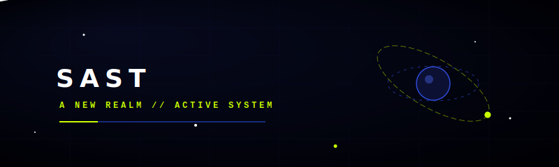

# SAST — Society for Aerospace and Technology

<p align="center">
  
</p>

Welcome to the official repository for **SAST (Society for Aerospace and Technology)**, a student-led club building aerospace and space-tech solutions. Powered by curiosity, driven by stars.

---

## 🚀 Projects and Divisions

Explore the sub-projects, divisions, and team members currently working in **A NEW REALM**:

- **Tech Division**: Automating test benches, remote ignitions, and sensors.
- **R&D Division**: Designing and verifying aerospace flight hardware.
- **Satellites Division**: CubeSats and mapping payloads.

---

## 🛠️ Tech Stack & Structure

The codebase is built on a modern, ultra-responsive web framework:
- **Core**: React 19 + Vite 8
- **Styling**: Pure CSS layout tokens for layout and pages
- **Animations**: Framer Motion / Custom transition sequences
- **CMS**: Local disk-writing dev CMS module (`Admin.jsx`)

---

## 💻 Run Locally

To spin up the local development server:

1. Navigate to the website subfolder:
   ```bash
   cd sast-website
   ```
2. Install dependencies:
   ```bash
   npm install
   ```
3. Start the dev server:
   ```bash
   npm run dev
   ```

Open `http://localhost:5173/` in your browser.

---

## 🌐 Deployment

The site is configured to compile and deploy automatically to GitHub Pages. To publish changes:
```bash
cd sast-website
npm run deploy
```

The live website can be viewed at:
👉 **https://SASTxNST.github.io/SAST_A_NEW_REALM/**
